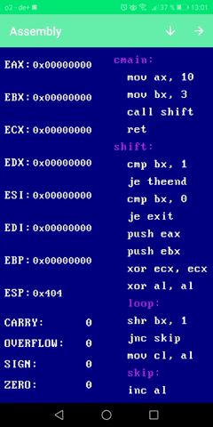

# Assembler-x86
A small x86 32-bit Assembler Interpreter Android Application written in Java.
Demos:

1.Local file save/open:

2. Source code of local file:

3. Debug Program:

4.Step Execution and Register changes:

------------------------------------------------------------------
